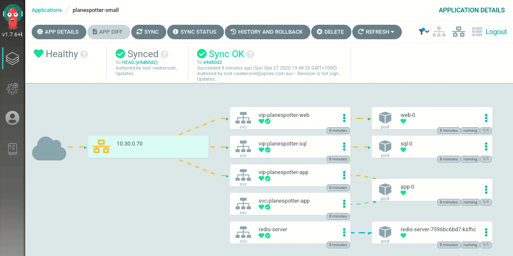

# `labops.sh`
**declarative gitops for compelling lab and demo environments**  



## What is it
`labops.sh` is a collection of bootstrap scripts organised to provide simple automation of multi-tier microservices applications for demo purposes.  

It creates VMs that are designed to be fully self-assembling, building upon each layer to the next, resulting in a fully functioning single-node Kubernetes cluster.  

It is engineered to be:  

**Simple**
- Clear and minimal entrypoints to start, fewest steps to known good

**Modular**
- Multiple components with clear and simple functions that build upon each other

**Serviceable**  
- Can easily be modified or extended, no logic hidden or embedded in hard to find places

**Portable**
- Designed with minimal or no external dependencies so it can be run on on virtualised public or private cloud environment  

After provisioning a VM, a fully working web application can then be deployed via the in-built catalogue reachable via: https://X.X.X.X:8472

## TLDR; Quick Start
The base VM image is based on Centos 7, is is deployed through an unattended network installation over the Internet.  
More information on how this works located here: https://github.com/apnex/pxe  

To use a completed node, simply download the pre-made ISO from here:  
https://labops.sh/boot.iso

It is a tiny 1MB ISO - as it contains only iPXE code.  
All remaining OS files will be bootstrapped over the Internet via HTTP.  
Just mount this ISO to a CDROM of a VM and power on.  

**Warning**: Ensure you have created your VM with the following settings:  

Minimum VM Specifications:  
- CPU: 4  
- MEM: 4 GB  
- DSK: 32 GB  

Boot Order (must be **BIOS**):  
- 1: HDD  
- 2: CDROM

This is to ensure that after installation, the VM will boot normally.  
If CDROM is before HDD, the VM will be in an infinite loop restarting and rebuilding itself!  

Once powered on, the `labops.sh` VM automatically evolves through 4 distinct, yet decoupled stages.  
Optionally, you can elect to download the ISO directly for the stage listed.  
This will allow you to stop there and customise your configuration.  

### 1. `base` node
- Minimal network installation of Centos 7 OS streamed over the Internet.
- No extraneous packages outside minimal core  
- Suitable for a wide variety of lab and demo tasks  

https://labops.sh/base/boot.iso  

### 2. `docker` node
- Builds upon 1), and prepares the node for Docker suitable for container use
- Useful for labs requiring docker  

https://labops.sh/docker/boot.iso  

### 3. `rke` node
- Builds upon 2), and provisions Kubernetes suitable for single-appliance use
- All-in-one k8s node suitable for local microservices deployment
- Batteries included - support Service Type=LoadBalancer and Dynamic PVCs

https://labops.sh/rke/boot.iso  

### 4. `labops` node
- Builds upon 3), and deploys the Argo CD platform for automated microservices control-plane on the node
- Auto evolves through all 4 steps ready for application use

https://labops.sh/boot.iso

### start with a minimal CentOS 7 VM
CPU: 4 vCPU  
MEM: 4 GB  
DISK: 32 GB  

[https://github.com/apnex/pxe](https://github.com/apnex/pxe)

### 
It is built to be highly modular, with 

---
### install docker
```
curl -fsSL http://labops.sh/docker/install | sh
```

### install rke
```
curl -fsSL http://labops.sh/rke/install | sh
```

### check cluster
```
kubectl get nodes
kubectl get pods -A
```

### clone labops
```
yum -y install git
git clone https://labops.sh
cd labops
```
